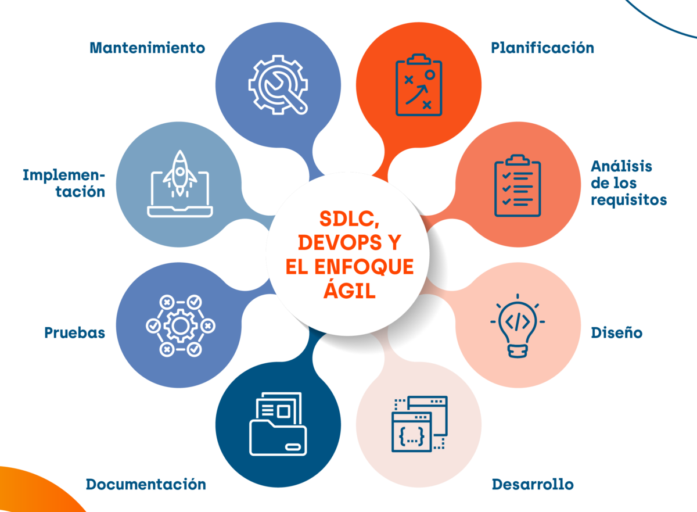
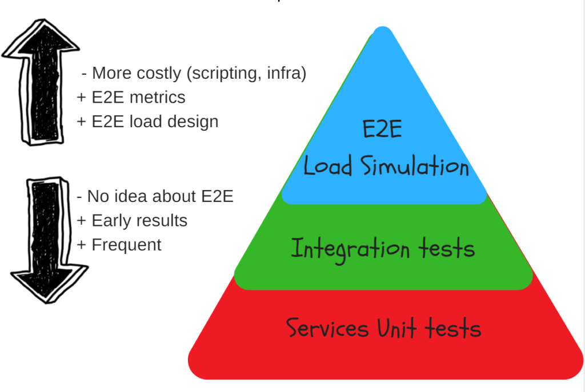

# Nest JS - Nest JS Testing

[Volver a Inicio](../README.md)

## TESTING Y CICLO DE VIDA DEL SOFTWARE

> En desarrollo web, el ciclo de vida del software describe las fases por las que pasa un proyecto desde que se concibe hasta que deja de usarse. Aunque hay distintas metodologías (ágiles, en cascada, etc.), los pasos esenciales suelen ser los mismos, solo cambia cómo se organizan o se solapan.

  

### 1. Análisis y planificación

- Se definen los objetivos del sitio o aplicación, el público objetivo y las funcionalidades clave.
- Ejemplo: Un cliente quiere una tienda online; se definen cosas como el catálogo, carrito, pasarela de pago y panel de administrador.
- Entregable: Documento de requisitos o backlog inicial.

### 2. Diseño

- Se decide la arquitectura (frontend, backend, base de datos, APIs), se crean prototipos de la interfaz, userstories, diagrama entidad/relación, tecnología a utilizar, etc.
- Ejemplo:
  - Frontend: HTML, CSS, JavaScript/React/Vue.
  - Backend: Node.js con Express/NestJS, base de datos PostgreSQL/MongoDB.
  - Diseño visual en Figma.
- Entregable: Wireframes, mockups, diagramas de arquitectura.

### 3. Desarrollo

- Se escribe el código. Suele dividirse en:
  - Frontend: estructura y diseño que ve el usuario.
  - Backend: lógica de negocio, APIs, manejo de datos.
  - Base de datos: creación de tablas/colecciones y relaciones.
- Ejemplo:
  - Frontend consume una API REST/GraphQL.
  - Backend gestiona usuarios, pedidos y pagos.
- Aquí suelen aplicarse metodologías ágiles para trabajar en sprints (etapas).

### 4. Documentación

- Registro claro de cómo funciona y cómo usar el sistema.
- Incluye:
  - Documentación técnica: estructura de código, API endpoints, dependencias.
  - Documentación de usuario: guías, manuales o tutoriales.
- Ejemplo:
  - API documentada con Swagger o Postman.
  - README.md en GitHub con pasos para instalación y despliegue.

### 5. Pruebas

- Se busca encontrar y corregir errores antes del lanzamiento.
- Ejemplo:
  - Pruebas unitarias (funciones del backend).
  - Pruebas de integración (frontend <-> backend).
  - Pruebas de usabilidad (flujo de usuario en el navegador).
- Herramientas: Jest, Cypress, Playwright, Postman.

### 6. Despliegue

- Se pone el sistema en un servidor accesible para usuarios.
- Ejemplo:
  - Backend desplegado en servicios como AWS, Render, Heroku.
  - Frontend alojado en Vercel, Netlify o en el mismo servidor.
- Configuración de dominio y HTTPS.
- Aquí es común usar integración/despliegue contínuo (CI/CD).

### 7. Mantenimiento

- Se corrigen bugs, se optimiza el rendimiento y se agregan mejoras.
- Ejemplo:
  - Actualizar librerías.
  - Mejorar tiempos de carga.
  - Añadir nuevas funciones como filtros o métodos de pago.

### Fin del ciclo

- El software deja de usarse o se reemplaza.

## TESTING

El testing es un proceso fundamental para asegurar que las aplicaciones funcionen correctamente, permitiendo verificar el comportamiento de los componentes de manera aislada y asegurando la calidad del código. NestJS facilita la realización de pruebas utilizando Jest como framework de testing por defecto, pero puede integrarse con otros frameworks de pruebas si se desea.

### Tipos de Testing según la automatización

- Manual: Una persona realiza las pruebas siguiendo un plan.
- Automatizado: Scripts y herramientas ejecutan las pruebas.
  - Herramientas web comunes: Jest, Mocha, Cypress, Playwright, Selenium.

### Tipos de Testing según el alcance

#### 1. Unit Testing (Pruebas Unitarias):

Se enfocan en probar unidades de código individuales, como controladores o servicios, en aislamiento.
En NestJS, puedes utilizar Mocks y Stubs para simular dependencias y concentrarte en la lógica de la unidad que estás probando.
Se realizan utilizando las clases reales o mediante el uso de inyecciones falsas para reemplazar dependencias.

#### 2. Integration Testing (Pruebas de Integración):

Estas pruebas verifican cómo interactúan varios módulos o componentes entre sí.
En NestJS, se utiliza un test module para simular el entorno del módulo real y se prueban las interacciones entre diferentes dependencias (por ejemplo, servicios y controladores).
A menudo se configuran con bases de datos en memoria como SQLite o MongoDB in-memory para pruebas más rápidas y realistas.

#### 3. End-to-End Testing (E2E):

Este tipo de pruebas se enfoca en probar el sistema completo, emulando la interacción del usuario con la API.
Se utiliza una instancia real del servidor NestJS, para verificar que todo el flujo de la aplicación funciona correctamente.
Se emplea supertest junto con Jest para hacer peticiones HTTP y verificar las respuestas.

#### 4. Aceptación / Usuario Final (Tests Manuales / De uso)

El cliente o usuarios validan si cumple con lo acordado.

  

## HERRAMIENTAS DE TESTING EN NestJS

- Jest: Framework por defecto para realizar pruebas en NestJS. Es potente, flexible y ampliamente utilizado en el ecosistema de Node.js.
- Supertest: Utilizado en pruebas de integración y E2E para realizar peticiones HTTP y validar respuestas.
- Test Utilities de NestJS: La función Test.createTestingModule() permite crear un entorno de prueba que emula los módulos de la aplicación real para pruebas unitarias e integradas.

### Beneficios del Testing en NestJS

- Confiabilidad: Garantiza que los componentes funcionen como se espera a lo largo del tiempo.
- Mantenimiento: Facilita la identificación y corrección de errores, permitiendo que el código sea más fácil de mantener.
- Documentación: Las pruebas sirven como documentación viviente del comportamiento de la aplicación.
- Prevención de Regresiones: Ayuda a evitar que nuevas actualizaciones o cambios en el código introduzcan errores no deseados.

  

# Acceso Directo VSC

"C:\Users\almaf\AppData\Local\Programs\Microsoft VS Code\Code.exe" "C:\Users\almaf\Desktop\ft63-m4-back-demo"
